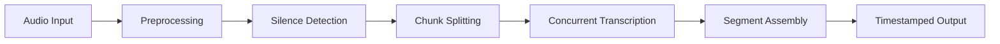

The `transcribe` function orchestrates a multi-stage pipeline that transforms raw audio into structured transcript segments. Here's how it works under the hood.

## Pipeline overview

The complete workflow spans five stages:



### Stage 1: Input validation

Before processing begins, Tafrigh validates your options (see `validateTranscribeFileOptions` in `/home/daytona/workspace/source/src/utils/validation.ts`):

```typescript
export const transcribe = async (
    content: ReadStream | string, 
    options?: TranscribeOptions
) => {
    logger.info?.(`transcribe ${content} (${typeof content}) with options: ${JSON.stringify(options)}`);
    
    validateTranscribeFileOptions(options);
    // ...
};
```

You can pass three types of input:
- **Local file path**: `'./audio.mp3'`
- **Remote URL**: `'https://example.com/audio.mp3'`
- **Readable stream**: `createReadStream('audio.mp3')` or `ytdl(videoUrl)`

### Stage 2: Audio preprocessing

The `formatMedia` function converts your input to a normalized MP3 with optional noise reduction:

```typescript
const filePath = await formatMedia(
    content,
    path.format({
        dir: outputDir,
        ext: '.mp3',
        name: Date.now().toString(),
    }),
    options?.preprocessOptions,
    options?.callbacks,
);
```

This stage:
1. Downloads remote URLs or reads streams
2. Applies high-pass/low-pass filters
3. Performs FFT-based noise reduction
4. Enhances dialogue frequencies
5. Saves the result to a temporary directory

<Info>
The temporary directory is created with `fs.mkdtemp('tafrigh')` and uses your OS temp folder (see `/home/daytona/workspace/source/src/index.ts:64`).
</Info>

### Stage 3: Chunk creation

The preprocessed audio is split at silence points to create manageable chunks:

```typescript
const chunkFiles = await splitFileOnSilences(
    filePath, 
    outputDir, 
    options?.splitOptions, 
    options?.callbacks
);

logger.debug?.(`Generated chunks: ${JSON.stringify(chunkFiles)}`);

if (chunkFiles.length === 0) {
    return [];
}
```

Each chunk includes timing metadata:

```typescript
[
  { filename: '/tmp/tafrigh/chunk_0.mp3', range: { start: 0, end: 58.3 } },
  { filename: '/tmp/tafrigh/chunk_1.mp3', range: { start: 58.3, end: 120.7 } },
  // ...
]
```

<Tip>
If the entire file is silent or below the minimum threshold, `chunkFiles` will be empty and `transcribe` returns `[]` immediately.
</Tip>

### Stage 4: Concurrent transcription

Chunks are processed in parallel based on available API keys and the `concurrency` option:

```typescript
const { failures, transcripts } = await transcribeAudioChunks(chunkFiles, {
    callbacks: options?.callbacks,
    concurrency: options?.concurrency,
    retries: options?.retries,
});
```

The `transcribeAudioChunks` function (from `/home/daytona/workspace/source/src/transcriber.ts:188-204`) determines the optimal parallelism:

```typescript
const apiKeyCount = getApiKeysCount();
const maxConcurrency = concurrency && concurrency <= apiKeyCount 
    ? concurrency 
    : apiKeyCount;

if (chunkFiles.length === 1 || concurrency === 1) {
    return transcribeAudioChunksInSingleThread(chunkFiles, callbacks, retries);
}

return transcribeAudioChunksWithConcurrency(
    chunkFiles, 
    maxConcurrency, 
    callbacks, 
    retries
);
```

**Concurrency logic:**
- If you have 3 API keys and set `concurrency: 5`, Tafrigh uses 3 workers (limited by keys)
- If you have 5 API keys and set `concurrency: 2`, Tafrigh uses 2 workers (respecting your limit)
- If `concurrency` is omitted, Tafrigh uses all available API keys

### Stage 5: Segment assembly

Successful transcriptions are sorted by timestamp and returned:

```typescript
transcripts.sort((a: Segment, b: Segment) => a.start - b.start);

if (failures.length === 0 && callbacks?.onTranscriptionFinished) {
    await callbacks.onTranscriptionFinished(transcripts);
}

return { failures, transcripts };
```

Each segment contains:

```typescript
{
  text: "Hello world",
  start: 0,              // Seconds in original audio
  end: 2.5,              // Seconds in original audio
  confidence: 0.95,      // Optional: Wit.ai confidence score
  tokens: [              // Optional: Word-level breakdown
    { text: "Hello", start: 0, end: 1.2, confidence: 0.98 },
    { text: "world", start: 1.3, end: 2.5, confidence: 0.92 }
  ]
}
```

## Error handling

If any chunks fail after all retries, the pipeline throws a `TranscriptionError`:

```typescript
if (failures.length > 0) {
    shouldCleanup = false;
    throw new TranscriptionError(
        `Failed to transcribe ${failures.length} chunk(s)`,
        {
            chunkFiles,
            failures,
            outputDir,
            transcripts,
        }
    );
}
```

<Warning>
When a `TranscriptionError` is thrown, the temporary directory is **not** cleaned up. This preserves failed chunks for retry with `resumeFailedTranscriptions`.
</Warning>

## Cleanup

By default, temporary files are deleted after successful transcription:

```typescript
finally {
    if (shouldCleanup && outputDir) {
        logger.info?.(`Cleaning up ${outputDir}`);
        await fs.rm(outputDir, { force: true, recursive: true });
    }
}
```

Set `preventCleanup: true` to preserve files for debugging:

```typescript
const transcript = await transcribe('audio.mp3', {
  preventCleanup: true
});
// Temporary files remain in /tmp/tafrigh*
```

## Complete example

Here's a full pipeline with progress tracking:

```typescript
import { init, transcribe } from 'tafrigh';

init({ apiKeys: ['key1', 'key2', 'key3'] });

const transcript = await transcribe('https://example.com/podcast.mp3', {
  concurrency: 3,
  retries: 5,
  
  preprocessOptions: {
    noiseReduction: {
      highpass: 300,
      lowpass: 3000,
      dialogueEnhance: true
    }
  },
  
  splitOptions: {
    chunkDuration: 60,
    silenceDetection: {
      silenceThreshold: -25,
      silenceDuration: 0.1
    }
  },
  
  callbacks: {
    onPreprocessingStarted: async (path) => 
      console.log(`Preprocessing: ${path}`),
    onSplittingStarted: async (total) => 
      console.log(`Splitting into ${total} chunks`),
    onTranscriptionStarted: async (total) => 
      console.log(`Transcribing ${total} chunks with 3 workers`),
    onTranscriptionProgress: (index) => 
      console.log(`Completed chunk ${index}`),
    onTranscriptionFinished: async (segments) => 
      console.log(`Generated ${segments.length} segments`)
  }
});

console.log(`Transcribed ${transcript.length} segments`);
```

## Performance considerations

<AccordionGroup>
  <Accordion title="Optimal chunk duration">
    Shorter chunks (30-45s) enable more parallelism but create more API requests. Longer chunks (90-120s) reduce overhead but limit concurrency. The default 60s balances both.
  </Accordion>
  
  <Accordion title="API key scaling">
    Each worker needs a dedicated API key due to Wit.ai rate limits. If you have 10 chunks and 3 keys, Tafrigh processes 3 at a time. Adding more keys speeds up large files proportionally.
  </Accordion>
  
  <Accordion title="Retry strategy">
    The default 5 retries with exponential backoff (1s, 2s, 4s, 8s, 16s) handles transient network issues. For unstable connections, increase `retries` to 7-10.
  </Accordion>
</AccordionGroup>
